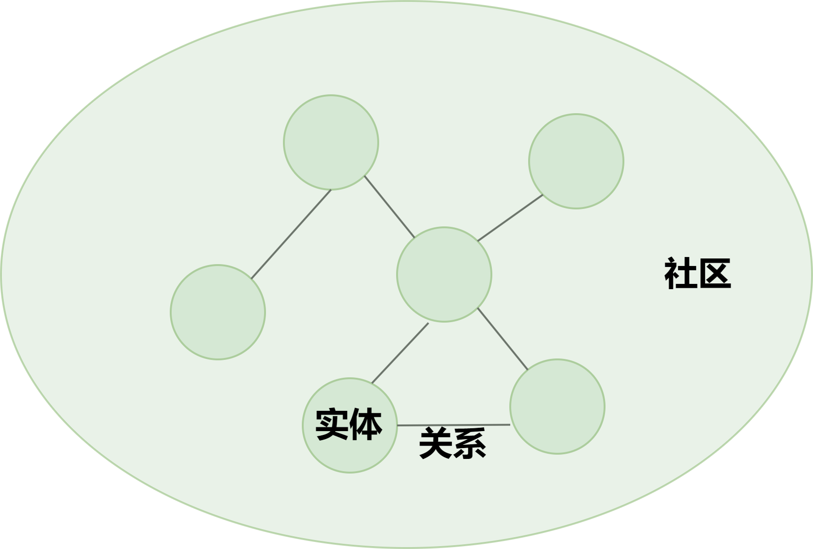
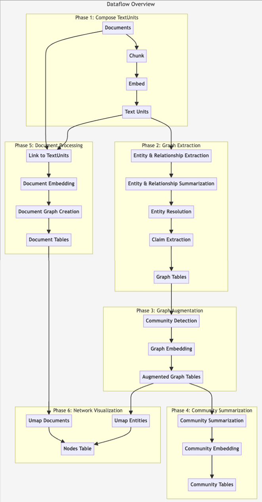

# 微软GraphRAG源码理解

## 1.引言

2024年四月份，微软发布一篇文章《From Local to Global: A Graph RAG Approach to Query-Focused Summarization》，提出了graphRAG的方法，该方法很好地解决了典型RAG系统在聚焦于查询的总结性 (QFS) 任务上存在的问题，并且在生成答案的全面性和多样性方面，Graph RAG 比朴素的 RAG 基线有了显着的改进。

2024年六月份，微软开源了graphRAG的项目 https://github.com/microsoft/graphrag 

为RAG带来新的发展，因此本人想从论文的原理以及源码部分去剖析和解读，希望进一步理解其核心结构，以求能做出一些速度上的优化

## 2.探究GraphRAG原理

- 为什么要在传统的RAG上发展GraphRAG？什么是GraphRAG？

传统RAG在针对整个文本语料库的全局问题上回答不佳，比如：这个数据集的主要主题是什么？这种问题不是简单的检索任务，是聚焦于查询的总结性任务。

GraphRAG核心思想：首先从源文档中派生一个实体知识图谱（通过大模型提取实体、关系，社区检测提取社区），然后为所有密切相关的实体组预先生成社区摘要。给定一个问题，每个社区摘要都用于生成部分响应，然后再次将所有部分响应汇总到对用户的最终响应中



- graphRAG原理

  

graphRAG中的一些名词：

**文档（Documents)**：输入的文档。

**文本单元（Text Unit)**:要分析的文本块。这些块的大小、它们的重叠以及它们是否遵循任何数据边界可以自行配置。一个常见的用例是将`CHUNK_BY_COLUMNS`设置为`id` ，以便文档和 TextUnit 之间存在一对多关系，而不是多对多关系

**实体（Entity）**：从 TextUnit 中提取的实体。它们代表人物、地点、事件或您提供的其他一些实体模型

**关系（Relationship）**：两个实体之间的关系。这些是从协变量生成的。

**协变量(Covariate)** ：提取的声明信息，其中包含有关实体的陈述，这些陈述可能是时间相关的。

**社区报告（Community Report）**：生成实体后，我们会对它们执行分层社区检测，并为该层次结构中的每个社区生成报告

**节点（Node）**：此表包含已嵌入和集群的实体和文档的渲染图形视图的布局信息



- **流程**

（1）   将文本切割为文本块

（2）   LLM识别文本中的实体。大模型首先识别文本中的所有实体，包括它们的名称、类型和描述，然后再识别明确相关的实体之间的所有关系，包括源实体和目标实体及其关系的描述；进行了多轮实体收集

（3）   为实体创建摘要 LLM来独立地创建可能隐含但未由文本本身陈述的概念的有意义的摘要，

（4）   实体摘要->同质无向加权图 社区检测算法来将图划分为彼此之间的连接比与图中的其他节点之间的连接更强的节点社区

（5）   生成社区摘要 

（6）  社区摘要 → 社区答案 → 全局答案；

- 准备社区摘要，社区摘要被随机打乱并分成预先指定的token大小的块。这确保了相关信息分布在各个块中，而不是集中（并可能丢失）在单个上下文窗口中；
- 映射社区答案。并行生成中间答案，每个块一个。这LLM还要求生成 0-100 之间的分数，表明生成的答案对于回答目标问题有多大帮助。得分为 0 的答案将被过滤掉。
- 减少到全局答案。中间社区答案按有用性分数的降序排序，并迭代添加到新的上下文窗口中，直到达到令牌限制。最终上下文用于生成返回给用户的全局答案。

最终提供两种搜索的方法：本地搜索和全局搜索

**本地搜索：**本地搜索方法通过将人工智能提取的知识图谱中的相关数据与原始文档的文本块相结合来生成答案。此方法适用于需要了解文档中提到的特定实体的问题（例如洋甘菊的治疗特性是什么？）

**全局搜索：**全局搜索方法通过以地图缩减方式搜索所有人工智能生成的社区报告来生成答案。这是一种资源密集型方法，但通常可以很好地回答需要理解整个数据集的问题（例如，本笔记本中提到的草药最重要的价值是什么？）

## 3.源码结构

源码的结构如下

```
├─config
│  ├─input_models
│  └─models
├─index
│  ├─cache
│  ├─config
│  ├─emit
│  ├─graph
│  │  ├─embedding
│  │  ├─extractors
│  │  │  ├─claims
│  │  │  ├─community_reports
│  │  │  ├─graph
│  │  │  └─summarize
│  │  ├─utils
│  │  └─visualization
│  ├─input
│  ├─llm
│  ├─progress
│  ├─reporting
│  ├─storage
│  ├─text_splitting
│  ├─utils
│  ├─verbs
│  │  ├─covariates
│  │  │  └─extract_covariates
│  │  │      └─strategies
│  │  │          └─graph_intelligence
│  │  ├─entities
│  │  │  ├─extraction
│  │  │  │  └─strategies
│  │  │  │      └─graph_intelligence
│  │  │  └─summarize
│  │  │      └─strategies
│  │  │          └─graph_intelligence
│  │  ├─graph
│  │  │  ├─clustering
│  │  │  │  └─strategies
│  │  │  ├─embed
│  │  │  │  └─strategies
│  │  │  ├─layout
│  │  │  │  └─methods
│  │  │  ├─merge
│  │  │  └─report
│  │  │      └─strategies
│  │  │          └─graph_intelligence
│  │  ├─overrides
│  │  └─text
│  │      ├─chunk
│  │      │  └─strategies
│  │      ├─embed
│  │      │  └─strategies
│  │      ├─replace
│  │      └─translate
│  │          └─strategies
│  └─workflows
│      └─v1
├─llm
│  ├─base
│  ├─limiting
│  ├─mock
│  ├─openai
│  └─types
├─model
├─prompt_tune
│  ├─generator
│  ├─loader
│  ├─prompt
│  └─template
├─query
│  ├─context_builder
│  ├─input
│  │  ├─loaders
│  │  └─retrieval
│  ├─llm
│  │  └─oai
│  ├─question_gen
│  └─structured_search
│      ├─global_search
│      └─local_search
└─vector_stores

```

### 3.1索引 Index

graphRAG第一步：构建索引，下面是执行语句

```
python -m graphrag.index --init --root ./ragtest
python -m graphrag.index --root ./ragtest
```

对应的源码在graphrag/index/\_\_main\_\_.py，其中\_\_main\_\_.py通过用户给定的参数去调用cli.py中的index_cli函数;

我们使用code2flow库生成index_cli的调用链的流程图，如下图所示


#### **（1）**初始化

该函数的_initialize_project_at函数首先检查settings.yaml、.env、prompts等文件是否存在，没有就创建，其中settings.yaml主要是记录llm的api_key、embedding的api_key,并行化的配置、异步模型的配置、文本分块、本地搜索、全局搜索配置等一些信息；env中就是graph_rag的api_key，prompts中主要是实体的提取、实体描述的总结、提取实体的声明、社区报告的生成的提示词，下面是对英文提示词的一个概括：

```
实体提取的提示词内容概括：
描述了一个任务，目的是从给定的文本文档中识别并提取指定实体类型的所有实体，以及这些实体之间的关系。具体步骤如下：

1. **识别实体**：从文本中识别出所有符合指定类型的实体。对于每个识别出的实体，提取以下信息：
   - **实体名称**：实体的名称（首字母大写）
   - **实体类型**：实体所属的类型（从给定的实体类型列表中选择）
   - **实体描述**：对实体的属性和活动的全面描述

   每个实体将以特定格式表示。

2. **识别关系**：从步骤1中识别出的实体中，找出所有明确相关的实体对（source_entity和target_entity）。对于每对相关实体，提取以下信息：
   - **源实体**：来源实体的名称
   - **目标实体**：目标实体的名称
   - **关系描述**：解释为何认为这两个实体之间存在关系
   - **关系强度**：一个数字评分，用于表示源实体和目标实体之间关系的强度

   每个关系也将以特定格式表示。

3. **生成输出**：最终的输出将是一个包含所有识别出的实体和关系的列表，格式化为指定的分隔符形式。

该任务的目的是从文本中结构化地提取出实体及其关系，以便进一步分析或使用。
```

```
实体描述总结的提示词内容概括：
下面描述了你的任务：你需要生成一个关于所提供数据的综合总结。具体步骤如下：

1. 给定一个或两个实体，以及与这些实体相关的一系列描述。
2. 将所有这些描述连接起来，形成一个完整的综合描述。
3. 确保包含所有描述中的信息，并解决其中可能存在的矛盾，提供一个连贯的总结。
4. 确保使用第三人称来撰写，并且要包括实体名称，以便提供完整的上下文。

最终输出将是一个完整的、无矛盾的描述，涵盖所有提供的描述信息。
```

```
提取声明的提示词内容概括：
这段话描述了一项任务，目标是帮助从文本文档中分析针对特定实体的声明。任务的具体步骤如下：

1. **提取实体**：从文本中提取与预定义的实体规范匹配的所有命名实体。实体规范可以是实体名称列表或实体类型列表。
  
2. **提取声明**：对于每个识别出的实体，提取与该实体相关的所有声明。这些声明需要与指定的声明描述相匹配，并且实体应为声明的主题。每个声明需要提取以下信息：
   - **主题实体**：作为声明主题的实体名称，需大写，且必须是步骤1中识别出的实体。
   - **对象实体**：声明中涉及的对象实体名称，需大写。如果对象实体未知，使用 **NONE**。
   - **声明类型**：声明的整体类别，需大写，并能在多个文本输入中重复使用，以便类似的声明共享相同的声明类型。
   - **声明状态**：标记为 **TRUE**（确认）、**FALSE**（虚假）或 **SUSPECTED**（怀疑）。TRUE 表示声明已确认，FALSE 表示声明被证伪，SUSPECTED 表示声明尚未验证。
   - **声明描述**：详细说明声明的依据，以及所有相关的证据和参考资料。
   - **声明日期**：声明提出的期间（开始日期和结束日期），需使用 ISO-8601 格式。如果声明只在某一天提出，则开始日期和结束日期相同。如果日期未知，返回 **NONE**。
   - **声明来源文本**：原始文本中与声明相关的所有引述的列表。

   每个声明按照特定的格式表示。

3. **生成输出**：最终输出将是所有识别出的声明的列表，格式化为指定的分隔符形式。

任务的总体目标是从文本中结构化地提取出与指定实体相关的声明及其详细信息，以便进一步分析和使用。
```

```
社区报告的提示词的内容概括：
这段话描述了一项任务，你作为一个AI助手，帮助人类进行信息发现。信息发现是指在一个网络中识别和评估与某些实体（例如组织和个人）相关的相关信息。

### 目标
编写一个关于某个社区的综合报告，该社区包含一组实体及其关系，以及可能相关的声明。报告将用于向决策者传达与该社区相关的信息及其潜在影响。报告的内容包括社区主要实体的概述、法律合规性、技术能力、声誉以及值得注意的声明。

### 报告结构

报告应包括以下部分：

- **标题**：代表社区关键实体的社区名称，标题应简短且具体。如果可能，应在标题中包含代表性的命名实体。
- **摘要**：社区整体结构的执行摘要，描述实体之间的关系以及与这些实体相关的重要信息。
- **影响严重性评分**：一个介于0到10之间的浮动分数，表示社区内实体可能带来的影响严重性。影响评分代表社区的重要性。
- **评分解释**：用一句话解释影响严重性评分。
- **详细发现**：列出关于社区的5到10个关键见解。每个见解应包括一个简短摘要，后跟多个段落的解释性文本，依据特定的规则进行支持。要求内容全面。

报告最终以JSON格式返回，包含标题、摘要、评分、评分解释和详细发现部分。

### 参考规则
支持数据的论点应列出数据引用。引用中最多列出5个记录ID，多于5个时使用“+more”表示有更多相关数据。

报告应基于提供的输入文本，不能编造信息。

这项任务的目的是为决策者提供一个全面的、基于数据的社区报告，以帮助他们理解社区内实体的动态及其潜在影响。
```

#### （2）创建pipeline

然后_create\_default\_config函数创建pipelineConfig，创建管道，以及其中的workflow工作流

具体步骤为首先检查配置文件，在\_read\_config\_parameters函数内部读取配置文件，主要就是加载yaml中定义的一些配置

然后根据当前配置参数，创建一个pipeline，在函数create_pipeline_config中，这个函数首先确定要跳过的工作流（workflows），获取嵌入字段，然后根据设置构建输入、报告、存储和缓存配置，下面是创建管道的核心代码

```python
result = PipelineConfig(
        root_dir=settings.root_dir,
        input=_get_pipeline_input_config(settings),
        reporting=_get_reporting_config(settings),
        storage=_get_storage_config(settings),
        cache=_get_cache_config(settings),
        workflows=[
            *_document_workflows(settings, embedded_fields),
            *_text_unit_workflows(settings, covariates_enabled, embedded_fields),
            *_graph_workflows(settings, embedded_fields),
            *_community_workflows(settings, covariates_enabled, embedded_fields),
            *(_covariate_workflows(settings) if covariates_enabled else []),
        ],
    )
```

这里涉及到微软的dataShaper库，DataShaper 提供了一组常用的数据转换操作，这些操作可以被链式调用，以形成复杂的数据处理流程。这些操作包括基本的数据表操作，如过滤、排序、分组等。

这些verb定义操作的具体实现在index/verbs中，有一些基础的verb是datashaper库自带的

现在我们对创建的workflows进行一个细致的解释，PipelineConfig中根据workflows/v1下的模板进行创建的，一共包括五个workflow，分别为：

- _document_workflows：对文本数据的处理，包括展开数组列、选择和重命名列、连接数据表、聚合数据、以及类型转换

- _text_unit_workflows：提取出基本的文本单元（text units），并对其进行一系列的数据处理，包括排序、打包、切分、重命名、生成ID、以及过滤空数据等操作

- _graph_workflows：提取实体数据，使用 `chunk` 列作为文本输入列，`chunk_id` 作为 ID 列，并将提取的实体保存到 `entities` 列，合并多个实体图（如多次提取的结果），将这些图的节点和边按指定操作进行合并。然后为提取的实体创建描述摘要，对实体图进行聚类，并将结果保存到 `clustered_graph` 列中，从聚类后的图中提取实体，生成最终的实体表，从聚类图中提取关系信息，生成最终的关系表

- _community_workflows：

  **准备节点数据 (`prepare_community_reports_nodes`)**

  - **描述**：这是一个子工作流，用于处理节点（通常代表实体）数据。输入源是从 `workflow:create_final_nodes` 中获取的节点数据。
  - **作用**：准备节点数据，为后续操作奠定基础。

  **准备边数据 (`prepare_community_reports_edges`)**

  - **描述**：这个子工作流处理边（关系）数据，输入源是从 `workflow:create_final_relationships` 中获取的关系数据。
  - **作用**：准备社区内实体之间的关系数据。

  **准备声明数据表 (`prepare_community_reports_claims`)**

  - **描述**：当 `covariates_enabled` 配置为启用时，处理与社区报告相关的声明数据。输入源是 `workflow:create_final_covariates`。
  - **作用**：生成包含社区报告相关声明的表。

  **获取社区层次结构 (`restore_community_hierarchy`)**

  - **描述**：从节点数据中恢复社区的层次结构，确定各节点的层级关系。
  - **作用**：构建社区内实体的层级关系，为社区报告提供结构性信息。

  **创建社区报告 (`prepare_community_reports`)**

  - **描述**：这是主工作流的一部分，整合节点、边和声明数据（如果启用）来准备社区报告的上下文信息。
  - **作用**：生成包含社区内实体、关系及相关声明的上下文信息，为最终社区报告的生成做准备。

  **生成社区报告 (`create_community_reports`)**

  - **描述**：根据准备好的上下文信息生成社区报告。此步骤结合了配置中的各项参数来生成最终的报告内容。
  - **作用**：生成最终的社区报告数据表。

  **为每个社区报告生成唯一 ID (`window`)**

  - **描述**：为每个生成的社区报告分配一个唯一的 UUID，区别于社区 ID。
  - **作用**：确保社区报告的唯一性和可区分性。

  **文本嵌入（文本内容、摘要、标题） (`text_embed`)**

  - 描述：将社区报告的完整内容、摘要和标题进行文本嵌入（text embedding），生成相应的嵌入向量，用于进一步的分析或机器学习任务。具体操作包括：
    - `community_report_full_content`：对报告的完整内容进行嵌入。
    - `community_report_summary`：对报告的摘要进行嵌入。
    - `community_report_title`：对报告的标题进行嵌入。
  - **作用**：将文本数据转换为嵌入向量，为后续的语义分析和机器学习提供基础

- _covariate_workflows：通过一系列的数据处理步骤，从text_units提取信息并转换为结构化的协变量表


#### （3）执行pipeline

1.加载配置和依赖项。load_pipeline_config和_apply_substitutions

2.设置存储、缓存、回调和进度报告器。\_create_storage、\_create_cache、\_create_reporte、_create_postprocess_steps

3.加载和验证数据集。

4.运行工作流，处理数据，并收集统计信息。

```
    async for table in run_pipeline(
        workflows=workflows,
        dataset=dataset,
        storage=storage,
        cache=cache,
        callbacks=callbacks,
        input_post_process_steps=post_process_steps,
        memory_profile=memory_profile,
        additional_verbs=additional_verbs,
        additional_workflows=additional_workflows,
        progress_reporter=progress_reporter,
        emit=emit,
        is_resume_run=is_resume_run,
    ):
```

5.存储结果和统计信息，处理异常


### 3.2 workFlow工作流的实现

### （1）测试

我们执行命令初始化一个rag的文件夹

```
python -m graphrag.index --init --root ./ragFile_test
```

新建input文件夹然后在input文件夹，修改yaml中的api_key和model

在input文件夹下放入一个txt文档并执行

```
python -m graphrag.index --root ./ragFile_test
```

我们来查看终端的打印的workflow

```
 GraphRAG Indexer
├── Loading Input (text) - 1 files loaded (0 filtered) ━━━━━━━━━━━━━━━━━━━━━━━━━━━━━━━━━━━━━━━━ 100% 0:00:00 0:00:00
├── create_base_text_units
├── create_base_extracted_entities
├── create_summarized_entities
├── create_base_entity_graph
├── create_final_entities
├── create_final_nodes
├── create_final_communities
├── join_text_units_to_entity_ids
├── create_final_relationships
├── join_text_units_to_relationship_ids
├── create_final_community_reports
├── create_final_text_units
├── create_base_documents
└── create_final_documents
🚀 All workflows completed successfully.
```

### （2）Loading Input

对应代码在graphrag/index/input/load_input.py

代码主要步骤为：

1. **文件类型判断**：
   - 代码中通过 `config.file_type` 来判断文件类型，并根据文件类型从 `loaders` 字典中选择对应的加载器。
   - 对于 `txt` 文件，如果 `file_type` 被设置为 `text`，那么代码将选择 `load_text` 作为加载器。
   - 对于csv文件，代码将选择 load_csv作为加载器
2. **加载流程**：
   - 假设输入为txt，代码将使用 `load_text` 方法来加载 `txt` 文件的内容，并将内容转换为一个 `pandas.DataFrame`。
   - 加载过程中，如果提供了 `ProgressReporter`，加载进度将通过 `progress_reporter.child` 创建的 `progress` 对象进行报告。
3. **异常处理**：
   - 如果 `config.file_type` 不属于 `loaders` 字典的键（即未知的文件类型），代码将抛出一个 `ValueError`，提示未知的输入类型。


### （3）create_base_text_units

代码在graphrag/index/workflows/v1目录下

里面涉及到很多datashaper库的verb以及自己定义的verb

具体步骤为：

排序、打包、聚合、文本切块、选择列、展开、重命名、生成ID、解压、复制、过滤空文本

主要关注一下文本切块，代码中使用’chunk‘这个verb，这个verb的函数定义在代码graphrag/index/verbs/text/chunk/text_chunk.py

chunk中有两种chunk策略可供选择：tokens和sentence，默认是tokens，默认的chunk_size是1200，chunk_overlap是100，tokens策略下的对应函数split_text_on_tokens，这个函数就是将文本按照chunk_size定义的每个文本块的最大token，将文本切割成多个较小的块，每个块中间保留部分冗余

sentence策略则是直接调用nltk库，将文本划分为一个个句子

### （4）create_base_extracted_entities

代码在graphrag/index/workflows/v1目录下，包含了四个verb：entity_extract、snapshot、merge_graphs、snapshot_rows


